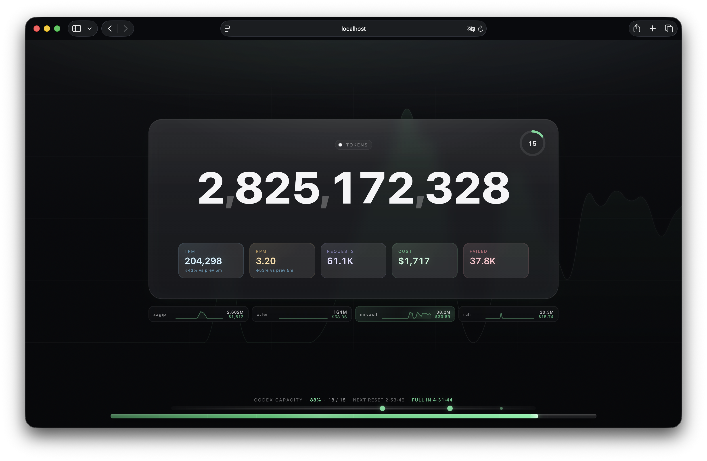

# token-counter-web

Minimal live statistics page for [CLIProxyAPI](https://github.com/router-for-me/CLIProxyAPI).

It reads the CLIProxyAPI Management API, renders total token usage, rolling TPM/RPM, request count, estimated API cost, Codex pool capacity, reset timeline, and per API-key usage cards.



## Features

- Total token counter with smooth odometer-style updates.
- Rolling TPM/RPM averaged over the last 5 minutes by default.
- Per API-key/user cards with mini usage graphs, total tokens in millions, and estimated cost.
- Codex 5-hour pool capacity based on the total remaining pool, not just account count.
- Forecast for the nearest pool event: depletion or full recharge.
- Subtle page background usage graph.
- Single Node.js process, no frontend build step and no runtime dependencies.

## Configuration

Copy the example env file:

```sh
cp .env.example .env
```

Set at least:

```env
MANAGEMENT_URL=http://127.0.0.1:8317/v0/management
MANAGEMENT_KEY=your_cli_proxy_management_key
```

The checked-in `.env.example` uses `host.docker.internal` because it is convenient for Docker Compose when `CLIProxyAPI` runs on the host machine. For a direct local `node` run, use `127.0.0.1` instead.

For Docker on macOS/Windows, when `CLIProxyAPI` runs on the host machine:

```env
MANAGEMENT_URL=http://host.docker.internal:8317/v0/management
```

Main environment variables:

| Variable | Default | Description |
| --- | --- | --- |
| `MANAGEMENT_URL` | `http://127.0.0.1:8317/v0/management` | CLIProxyAPI Management API base URL. |
| `MANAGEMENT_KEY` | empty | CLIProxyAPI `remote-management.secret-key`. |
| `PORT` | `4173` | Web server port. |
| `POLL_INTERVAL_MS` | `5000` | Usage poll interval. |
| `AUTH_POLL_INTERVAL_MS` | `10000` | Auth/quota poll interval. |
| `RATE_WINDOW_SEC` | `300` | Rolling TPM/RPM window. |
| `CHART_WINDOW_SEC` | `14400` | Background and per-user graph window. |
| `CHART_BUCKETS` | `48` | Number of graph buckets. |
| `CODEX_RATE_HISTORY_MS` | `900000` | Codex burn-rate history window. |
| `CODEX_QUOTA_CONCURRENCY` | `6` | Number of Codex quota checks to run in parallel. |
| `API_USERS_LIMIT` | `4` | Number of API user cards shown: active users first, then top users by total tokens. |
| `CODEX_USAGE_URL` | ChatGPT WHAM usage endpoint | Codex quota URL called through CLIProxyAPI `/api-call`. |
| `MODEL_PRICES_JSON` | built-in defaults | Optional USD-per-1M-token price overrides. |

Endpoint-specific overrides are also supported: `MANAGEMENT_USAGE_URL`, `MANAGEMENT_AUTH_FILES_URL`, and `MANAGEMENT_API_CALL_URL`.

Legacy names `TOKEN`, `UPSTREAM_BASE`, `UPSTREAM_URL`, `AUTH_FILES_URL`, and `API_CALL_URL` still work for compatibility.

## Local Run

```sh
node --env-file=.env server.js
```

Open:

```txt
http://localhost:4173
```

## Docker

Build and run with Compose:

```sh
docker compose up -d --build
```

Then open:

```txt
http://localhost:4173
```

The Docker image is intentionally small: it uses `node:22-alpine`, copies only `server.js`, `package.json`, and `public/`, and does not run `npm install` because the app has no package dependencies.

## Management API Requirements

In `CLIProxyAPI`, management routes must be available and usage statistics should be enabled:

```yaml
usage-statistics-enabled: true
remote-management:
  secret-key: your_cli_proxy_management_key
```

The app uses:

- `GET /v0/management/usage`
- `GET /v0/management/auth-files`
- `POST /v0/management/api-call`

Do not commit `.env`; it contains the management key.
